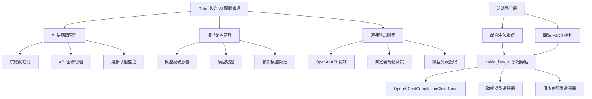
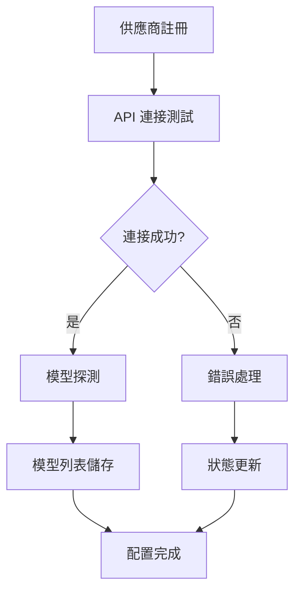
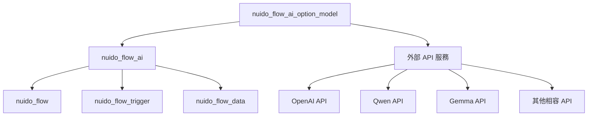
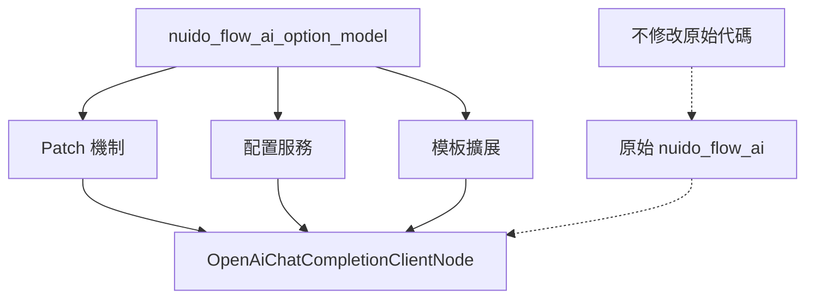

# Nuido Flow AI Option Model 模組需求規劃

## 1. 專案概述

### 1.1 核心目標
- **動態 API 配置管理**: 可以新建一個 Form 可以輸入 api url, api key，在連接無誤後，可以取得此 api 下有多少 model 可以使用
- **模型選擇和儲存**: 在此 Form 中可以挑選要使用的 model，並儲存起來
- **seamless 整合**: 在 OpenAiChatCompletionClientNode 可以挑選此 Form 設定好的 API 廠商及 Model，即可回到原來 nuido_flow_ai 的原本機制中
- **非侵入式設計**: 完全不改 nuido_flow_ai，只在 nuido_flow_ai_option_model 中擴展原先的不足

### 1.2 問題解決範圍
解決 `user/nuido_flow_ai` 模組中發現的關鍵問題：

1. **屬性綁定錯誤**: 在 `openai_chat_completion_client_node.xml` 中使用 `props.node.dynamic_date_interval` 來檢查選中狀態，但應該使用 `props.node.model`
2. **硬編碼選項**: 模型選項（qwen2.5-7b-instruct, gemma-3-4b-it, hermes-3-llama-3.1-8b）直接寫死在模板中，不利於動態擴展
3. **事件處理不一致**: JavaScript 中更新 `props.node.model`，但 XML 中檢查 `dynamic_date_interval`

### 1.3 支援範圍
- **API 格式**: 支援標準 OpenAI API 格式的所有供應商（如 Qwen、Gemma、Claude 等）
- **管理方式**: 在 Odoo 後台新增獨立的「AI 配置管理」模組，用戶可以集中管理所有 AI 供應商

### 1.4 系統架構總覽



## 2. 功能需求分析

### 2.1 動態 API 配置管理系統

#### 2.1.1 供應商管理


**功能特性**:
- 供應商基本資訊管理（名稱、API URL、API Key）
- 供應商類型分類（OpenAI 官方、OpenAI 相容、自定義）
- 連接狀態實時監控
- 錯誤訊息記錄和展示

#### 2.1.2 API 連接測試
- **測試機制**: 標準 OpenAI API `/v1/models` 端點測試
- **超時設定**: 30秒連接超時
- **錯誤處理**: HTTP 狀態碼和錯誤訊息捕獲
- **狀態追蹤**: 未測試、連接成功、連接失敗、測試中

### 2.2 模型發現和選擇機制

#### 2.2.1 自動模型探測
```python
# API 探測流程
GET {api_base_url}/v1/models
Authorization: Bearer {api_key}

# 預期回應格式
{
    "data": [
        {
            "id": "model-id",
            "object": "model",
            "created": timestamp,
            "owned_by": "organization"
        }
    ]
}
```

#### 2.2.2 模型管理功能
- **模型屬性**: 名稱、ID、描述、最大Token數、串流支援
- **可用性管理**: 啟用/停用狀態
- **預設模型設定**: 每個供應商可設定預設模型
- **驗證機制**: 定期驗證模型可用性

---

**下一章節將包含：** 配置儲存和管理、與原有系統的整合方式

## 3. 技術架構設計

### 3.1 模組依賴關係


### 3.2 非侵入式整合策略


## 4. 開發規劃

### 4.1 開發階段劃分

#### 4.1.1 第一階段：核心資料模型 (2-3天)
- Python 資料模型完成
- API 探測服務實現
- 基礎單元測試

#### 4.1.2 第二階段：後台管理界面 (2-3天)
- 供應商管理界面
- 模型管理界面
- 操作流程完整

#### 4.1.3 第三階段：前端整合層 (3-4天)
- 配置服務實現
- 節點 Patch 機制
- 動態模型選擇器

#### 4.1.4 第四階段：部署與測試 (1天)
- 預設供應商配置
- 完整測試套件
- 部署文檔

### 4.2 關鍵里程碑

| 里程碑 | 時間 | 關鍵指標 |
|--------|------|----------|
| M1: 後端模型完成 | 第3天 | 資料模型、API 服務可用 |
| M2: 後台界面完成 | 第6天 | 完整管理功能可用 |
| M3: 前端整合完成 | 第10天 | 動態配置功能可用 |
| M4: 系統上線 | 第11天 | 完整系統可用 |

**總計**: 8-11 個工作天

openrouter: api key: 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